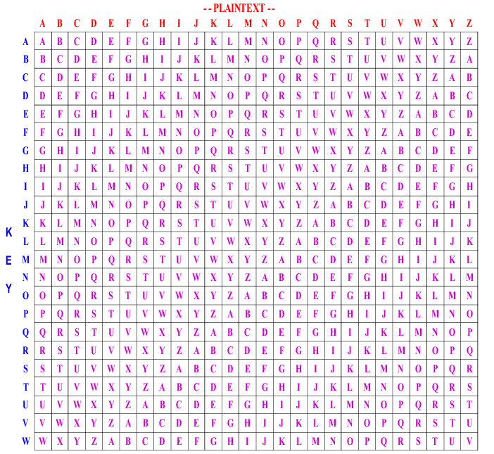

# Vigenère Cipher

It is a method of encrypting alphabetic text. It uses a simple form of **polyalphabetic substitution**. A polyalphabetic cipher is any cipher based on
substitution, using multiple substitution alphabetic. The encryption of the original text is done using the **Vigenère square or **Vigenère table**.

 - The table consists of alphabets written out 26 times in different rows, each alphabet shifted cyclically to the left compared to the previous 
 alphabet, corresponding to the 26 possible **Caesar Ciphers**.
 - At different points in the encryption process, the cipher uses a different alphabet from one of the rows.
 - The alphabet used at each point depends on a repeating keyword.
 
 

 ## Encryption 

 The first letter of the plaintex, for example: Geeks. G is paired with A, the first letter of the key. So use row G and column A of the Vigenère square namely G. Similarly, for the second letter of the plaintext, the second letter of the key is used, the letter at row E and column Y is C. The rest of the plaintext is enciphered in a similar fashion.

## Decryption 

It is performed by going to the row in the table corresponding to the key, finding the position of the ciphertext letter in this row, and then using the column's label as the plaintext. For example, in row A (from AYUSH), the ciphertext G appears in column G, which is the first plaintext letter. Next we go to row Y (From AYUSH), locate the ciphertext C which is found in column E, thus E is the second plaintext letter.

A more easy implementation could be to visualize Vigenère algebraically by converting [A-Z] into numbers [0-25].
```
// Encryption
The plaintext(P) and key(K) are added modulo 26.
Ei = (Pi + Ki) mod 26

// Decryption
Di = (Ei - Ki + 26) mod 26
```
**NOTE:** Di denotes the offset of the i-th character of the plaintext. Like offset of `A` is 0 and of `B` is 1 and so on. 